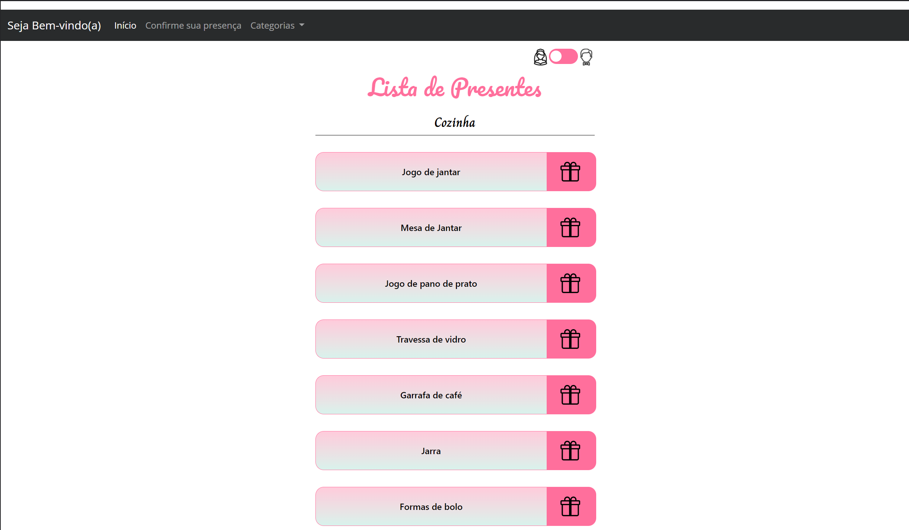
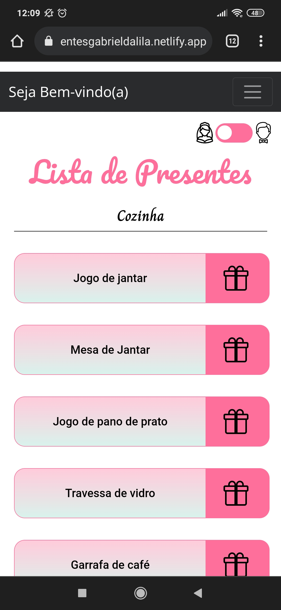

<h1 align="center">Lista de presentes</h1> 

Solução para dar praticidade ao convite virtual, facilidade de sugestão e escolha de um presente para o casal.
Projeto onde me trouxe desafios e grandes aprendizados.

Projeto hospedado: https://presentesgabrieldalila.netlify.app/

<h1 align="center">App</h1> 
<div align="center">
  <h4 align="center">Layout Desktop</h4> 
  </img><br>
  <h4 align="center">Layout Mobile</h4> 
  </img><br>
</div>

<h2>Tecnologias Utilizadas</h2>

<ul>
  <li><a href="https://vuejs.org/">Vue.js</a></li>
  <li><a href="https://getbootstrap.com/">Bootstrap</a></li>
  <li><a href="https://mockapi.io/">MockApi</a></li>
  <li><a href="https://sweetalert2.github.io/">Sweetalert2</a></li>
  <li><a href="https://www.netlify.com/">Netlify</a></li>
</ul>
  

## Project setup
```
npm install
```

### Compiles and hot-reloads for development
```
npm run serve
```

### Compiles and minifies for production
```
npm run build
```

### Customize configuration
See [Configuration Reference](https://cli.vuejs.org/config/).
